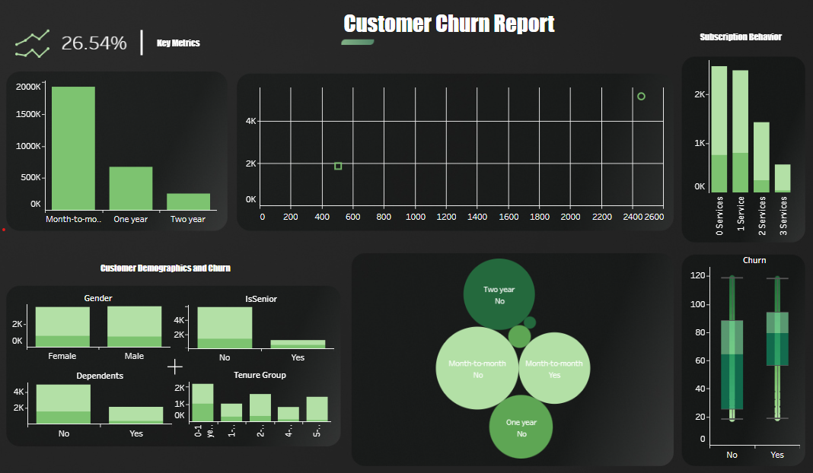
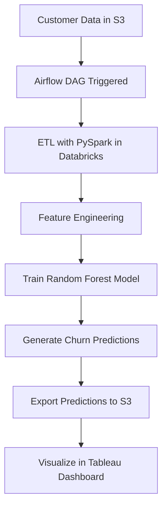

# 📊 Customer Churn Analysis/Prediction Pipeline

### End-to-end data project with focus in understand more about the costumers and churn.

## 🚀 Overview

This project demonstrates a production-grade data pipeline built to predict customer churn using the Telco customer churn dataset. with focus in develop using only free tools.

Key components:
- ✅ Data ingestion from AWS S3
- ✅ ETL with PySpark & SQL (Databricks & Spark)
- ✅ Feature engineering and ML model training (Random Forest)
- ✅ Automation with Apache Airflow
- ✅ Containerized with Docker
- ✅ Dashboarded insights via Tableau

## 📸 Dashboard Preview

you can check the dashboard here: [customer churn report](https://public.tableau.com/views/customer_churn_report/Dashboard1?:language=en-US&:sid=&:redirect=auth&:display_count=n&:origin=viz_share_link)

### some KPIS ⭐

* Churn Rate (%)

* Avg Monthly Charges

* Estimated Revenue Lost

## 🔁 Workflow Diagram

